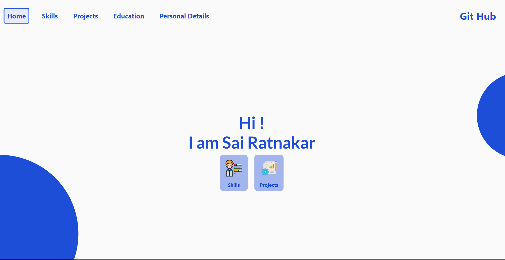

# Portfolio Web Site

[Open Portfolio web site](https://sairatnakarportfolio.web.app/#/)

This project was created with Flutter and showcases my skills and experience in flutter development.I have gained hands-on experience in the following areas:

- **User Interface (UI) Design**: Created visually appealing and responsive user interfaces using Flutter's widget system.

- **State Management**: Riverpod, Getx.

- **Integration with APIs**: Connected the app to external APIs to fetch and display dynamic data, demonstrating proficiency in working with asynchronous operations.

